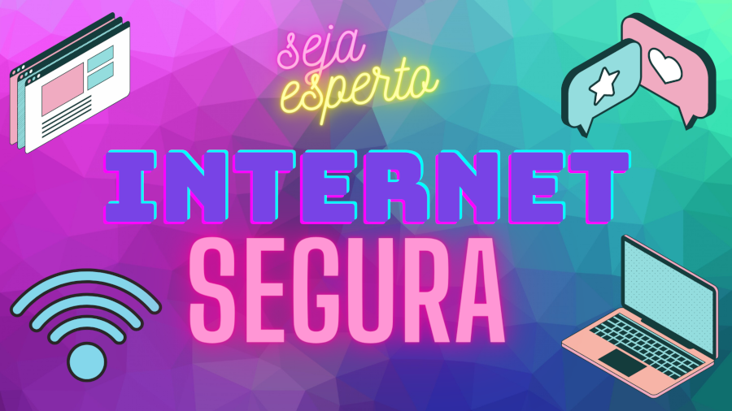

# Internet Segura 👩‍🏫

Objetivo: Essa é uma ideia de site educativo para que as crianças aprendam segurança da informação de maneira interativa.

### 🛠 Tecnologias

As seguintes ferramentas foram usadas na construção do projeto:
HTML5, CSS3 e JS.

<h4 align="center"> 
	🚧  Exercício 🚀 Finalizado...  🚧
</h4>

Autora: Renata Silva Bezerra

 
